# Celestial Architecture (v4) 🌌

## Overview
The system is now a **Platform**, characterized by its extensibility and experimental capabilities.

## High-Level Structure

```mermaid
graph TD
    User -->|UI| Frontend[React App]
    Frontend -->|API| Gateway[API Gateway]
    
    subgraph "Frontend Core"
        Frontend --> Labs[Labs Dashboard]
        Frontend --> Engine[Template Engine]
        Engine --> Templates[Dynamic Templates]
    end

    subgraph "Backend Core"
        Gateway --> Auth[Auth Service]
        Gateway --> CV[CV Service]
        Gateway --> BI[BI Service]
        
        CV --> EventBus[Event Bus 📢]
        Auth --> EventBus
        
        EventBus --> Plugins[Plugin Layer]
        EventBus --> Monitor[Monitor Service]
    end

    subgraph "Intelligence Layer"
        BI --> Advisor[Pricing Advisor]
        Monitor --> Profiler[Performance Profiler]
    end
```

## Key Components

### 1. Feature Registry (Labs)
- **Role**: Controls feature flags.
- **Location**: `src/domain/experiments/feature-registry.ts`.
- **State**: Persisted in local storage via Zustand.

### 2. Template Engine
- **Role**: Generates visual styles from configuration.
- **Location**: `src/domain/templates/TemplateEngine.ts`.
- **Input**: `TemplateConfig` (JSON).
- **Output**: CSS Variables & Tailwind Classes.

### 3. Event Bus
- **Role**: Decouples logic from side-effects.
- **Location**: `server/services/event-bus.ts`.
- **Events**: `USER_REGISTERED`, `CV_CREATED`, etc.

### 4. Deep Health
- **Role**: System observability.
- **Endpoint**: `/api/health/deep`.
- **Metrics**: DB Latency, Memory RSS, Uptime.

## Database Schema Notes
- **Users**: Indexed on `email`, `subscriptionStatus`.
- **CVs**: Indexed on `userId`, `updatedAt`.
- **Subscriptions**: Indexed on `stripeCustomerId`.
