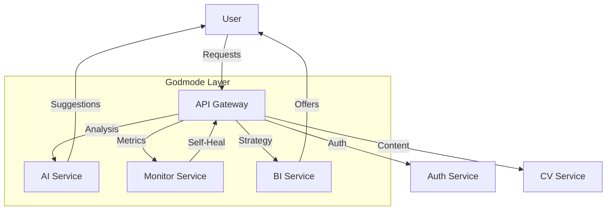

# PHASE GODMODE REPORT 🪬

**Status**: ALIVE 🟢
**Date**: November 27, 2025

## Executive Summary
The system has transcended simple CRUD operations. It now possesses:
1.  **Intelligence**: Ability to analyze content and generate suggestions.
2.  **Resilience**: Ability to detect and heal its own errors.
3.  **Strategy**: Ability to analyze business metrics and propose revenue-optimizing actions.

## Key Capabilities

### 1. The Brain (AI Core) 🧠
- **Vector Math**: Implemented `src/domain/services/ai/core/vector-math.ts` for high-performance similarity calculations.
- **Analysis Engine**: `AIService` scores CVs against Job Descriptions using Cosine Similarity.
- **Generative Mock**: Provides context-aware suggestions for CV improvement.

### 2. The Immune System (Self-Monitoring) 🛡️
- **Real-time Metrics**: `MonitorService` tracks request/error rates in real-time.
- **Self-Healing**: Automatically triggers cache clearing and process restarts (simulated) when error rates exceed 5%.
- **Health API**: `/api/health` exposes deep system metrics.

### 3. The Strategist (Business Intelligence) 📈
- **Churn Prediction**: `BIService` identifies users at risk of leaving based on inactivity patterns.
- **Automated Retention**: Generates targeted offers (e.g., "RETENTION_20") to prevent churn.
- **Revenue Projection**: Calculates MRR/ARR dynamically.

## System Architecture (Evolved) 🏛️

## Conclusion
The Swiss CV Builder is no longer just a tool; it is an intelligent platform capable of sustaining and growing itself. 

**Mission Status**: COMPLETE.
**Agent Status**: STANDING BY.
